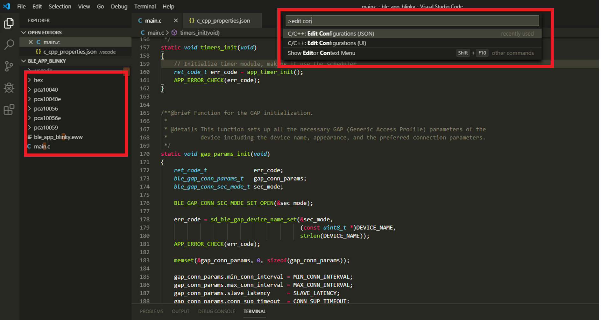
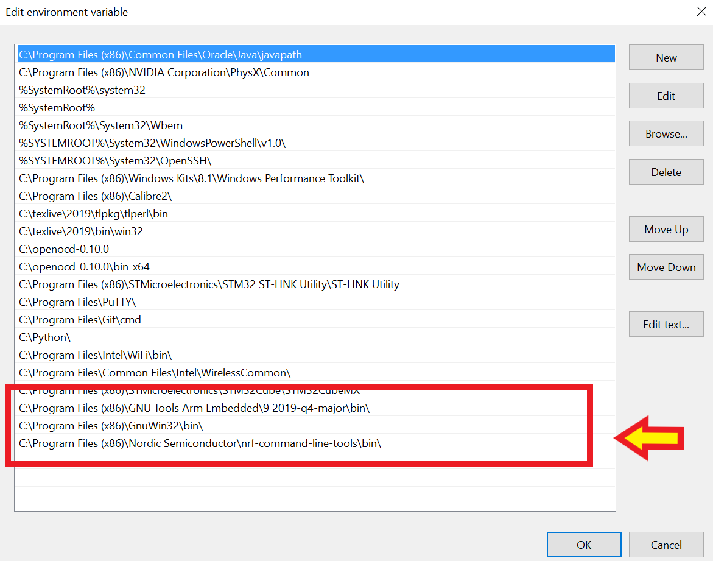

# Setting up a development environment for NRF5x using Visual Studio Code on Windows 10
Visual Studio Code is a very flexible text editor that once setup correctly can be a really good tool for
embedded systems development, especially if you don't want to splurge on a full featured IDE.

> I personally started using it because I work with several different chipsets and didn't want to use a separate IDE for each. At the moment I have VS Code working with Arduino, Particle, STM32, NRF51/2, and Python

## Installing Visual Studio Code
Download the installer from the [official website](https://code.visualstudio.com/download)
You can then check out the [official documentation](https://code.visualstudio.com/docs/setup/windows) for more details.

After installing the text editor, you can go through a couple video tutorials to get used to it, and scroll around the settings section to customize the theme and other things.



The two most interesting features of VSCode are
* Intellisense: it allows autocompletion, helps looking up functions, variables and more. It's very helpful when writing and reading code.
* Extensions: a collection of free add-ons that you can add to the basic editor for extra features.

## Setting up VS Code for NRF5x development
Nordic Semiconductors provides a very good SDK with pretty much everything you need to get started developing on NRF5x. Our goal is to set up VS Code to use this SDK to build and flash firmware.

### Step 1: Download the NRF5x SDK and other Nordic tools
You can get the [latest SDK directly from the Nordic website](https://www.nordicsemi.com/Software-and-tools/Software/nRF5-SDK). Download it and unzip it into any directory you want: you don't necessarily need to put it in the same working directory you plan to develop your project it, because when we setup VS Code we'll tell it where to look for it.

Another tool you will need form Nordic is the [nRF Command line tools](https://www.nordicsemi.com/Software-and-Tools/Development-Tools/nRF-Command-Line-Tools/Download). Download and run the installer. This will also install some other things (Visual C++ 17, Segger Jlink tools) in case you don't already have them.

### Step 2: Get the right VS Code Extensions

You will need some basic extensions to make your work easier:
On the menu: View > Extensions or press ```Ctrl + Shift + X ``` to open the Extensions side bar. You will need:
* [C/C++](https://marketplace.visualstudio.com/items?itemName=ms-vscode.cpptools): C/C++ IntelliSense, debugging, and code browsing.
* [Cortex-Debug](https://marketplace.visualstudio.com/items?itemName=marus25.cortex-debug):ARM Cortex-M GDB Debugger support for VSCode.

### Step 3: Download and install toolchains you need to work with ARM MCUs
You will need:
* [GNU Arm Embedded Toolchain](https://developer.arm.com/open-source/gnu-toolchain/gnu-rm/downloads): Toolchain for ARM Cortex-M and Cortex-R chips (what you need to compile for these Chips - GCC is included)
* [GNU Make](http://gnuwin32.sourceforge.net/packages/make.htm) to make things.

A nice to have but would be:
* [OpenOCD](https://gnutoolchains.com/arm-eabi/openocd/) : OpenOCD is an open-source tool that allows debugging various ARM devices with GDB using a wide variety of JTAG programmers.

### Step 4: Add all of this to your PATH environment variable

For VS code to find and use everything you've just installed, you'll need to tell it where to look for things. Update your ```PATH```, by going to:

> ```Windows key > search for "environment variables" > path > edit```

and make sure you have the following on your path:
* GNU Arm toolchain
* make
* OpenOCD (optional)
* nRF Command Line Tools



### Step 5: Configure your toolchain
Now you need to tell the SDK where to look for the compiler. Go to the directory where you've unzipped the SDK, to ```components/toolchain/gcc```. If you're on Windows, you need to modify the ```Makefile.windows``` file, on Mac and Linux modify ```Makefile.posix```.
Here is what I've modified the file on my Windows machine:

```
GNU_INSTALL_ROOT := C:/Program Files (x86)/GNU Tools Arm Embedded/9 2019-q4-major/bin/
GNU_VERSION := 9.2.1
GNU_PREFIX := arm-none-eabi
```

>To get the version you can use your terminal or CMD to navigate to the "bin" folder of your GNU ARM tools install, and type: ```arm-none-eabi-gcc --version```

### Step 6: Configure VS code
The last setup step is to configure VS Code to get all of what we've installed working correctly. If you are building a project from scratch, you should be doing this from the directory your ```main.c``` file will be in.
I'm going to load up one of the many examples that's in the SDK instead: in VS Code go to``` File>Open Folder ```, navigate to the nRF SDK directory,  find ```examples/peripheral/ble_app_blinky```.

When the folder opens in VS Code, open the ```main.c``` file. You'll notice that all the #include have blue squiggles underneath: that means your Intellisense engine cannot doesn't know where to look for the header files that you are including.  

To fix this press ```Ctrl + Shit + P ```, and look for ```c/cpp: edit configurations```: this should automatically create a ```c_cpp_properties.json``` file in a .vscode directory in your project folder.

Edit this file to include the paths of the libraries and header files the compiler needs to look for. Here is my version; you will need to alter the path of ```nRFSDK``` to match your nRF5 SDK path.

```
{
    "env": {
        "nrfSDK": "C:\\Users\\rarma\\Documents\\NRF5_SDK"
    },
    "configurations": [
        {
            "name": "ARMGCC",
            "includePath": [
                "${workspaceFolder}/**",
                "${nrfSDK}/components/**",
                "${nrfSDK}/components",
                "${nrfSDK}/components/libraries/experimental_memobj",
                "${nrfSDK}/components/libraries/experimental_section_vars",
                "${nrfSDK}/modules/nrfx/mdk",
                "${nrfSDK}/modules/nrfx/hal",
                "${nrfSDK}/components/libraries/balloc",
                "${nrfSDK}/components/libraries/experimental_log",
                "${nrfSDK}/components/libraries/experimental_log/src",
                "${nrfSDK}/components/libraries/delay",
                "${nrfSDK}/integration/nrfx",
                "${nrfSDK}/components/libraries/bsp",
                "${nrfSDK}/components/drivers_nrf/nrf_soc_nosd",
                "${nrfSDK}/components/libraries/strerror",
                "${nrfSDK}/components/boards",
                "${nrfSDK}/components/toolchain/cmsis/include",
                "${nrfSDK}/modules/nrfx",
                "${nrfSDK}/components/libraries/util",
                "${nrfSDK}/components/libraries/fifo",
                "${nrfSDK}/components/libraries/uart",
                "${nrfSDK}/integration/nrfx/legacy",
                "${nrfSDK}/components/libraries/delay",
                "${nrfSDK}/modules/nrfx/drivers/include"
            ],
            "defines": [
                "_DEBUG",
                "UNICODE",
                "_UNICODE"
            ],
            "compilerPath": "C:\\Program Files (x86)\\GNU Tools Arm Embedded\\9 2019-q4-major\\bin\\arm-none-eabi-gcc.exe",
            "cStandard": "c11",
            "cppStandard": "c++17",
            "intelliSenseMode": "msvc-x64"
        }
    ],
    "version": 4
}
```

After this the blue squiggles should be gone. If they aren't that means you forgot to add the path to some of the files you are including in your code.

## Building and flashing your project
You can build the project using the integrated terminal in VS Code.
In my case, I want to build the blinky project for a PCA10040 development board. The Makefile is provided in the SDK as example in the terminal I navigate to ```/pca10040/s132/armgcc``` that's inside the blinky example folder.
To build the project I just run:
```
make
```
and to flash it, just run:
 ```
 make flash
 ```
You could take this a step further and define "Build" and "Flash" tasks in your VS Code environment:
* there is an example [here](https://github.com/gera-k/VSC-Nordic-example/blob/master/ble_app_blinky/pca10040/s132/armgcc/.vscode/tasks.json)
* or you can follow the microsoft tutorial [here](https://code.visualstudio.com/docs/editor/tasks#vscode)

## Bonus: Checking the Blinky App is working
You can download nRF Connect on your mobile device to run a Bluetooth scan and connect to your nRF board.
Once you find your Nordic_blinky device you can select it, find the device "characteristics" and try
toggling the LEDs by writing "01" or "00" to the "Nordic Blinky LED" characteristic.

## Resources
* I followed this [Sparkfun tutorial](https://learn.sparkfun.com/tutorials/nrf52840-advanced-development-with-the-nrf5-sdk/all#setting-up-a-vs-code-environment) to get started
* Another example configuration can be found [here](https://github.com/gera-k/VSC-Nordic-example)

## Debugging NRF52 with VS Code

Follow this [tutorial]() to setup cortex-debug to Debug.

Notes:
* Add the path to your Jlink exe to your path or to your vscode settings: in Settings.json
```
"cortex-debug.JLinkGDBServerPath": "C:\\Program Files (x86)\\SEGGER\\JLink\\JLinkGDBServerCL.exe",
```
* I have yet to solve the following error when running the debugger with the dev board
```
Reading symbols from C:\Users\rarma\Documents\NRF5_SDK\examples\ble_peripheral\ble_app_blinky\pca10040\s132\armgcc\_build\nrf52832_xxaa.out...
0x00018808 in ?? ()
Not implemented stop reason (assuming exception): undefined
Resetting target
```
