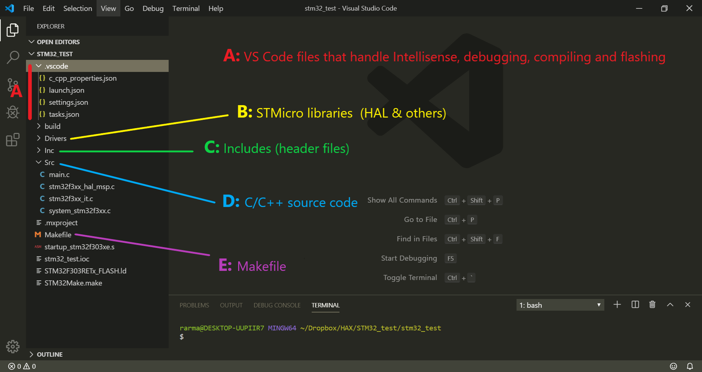

# Setting up a development environment for STM32 using Visual Studio Code on Windows 10
Visual Studio Code is a very flexible text editor that once setup correctly can be a really good tool for
embedded systems development, especially if you don't want to splurge on a full featured IDE.

> I personally started using it because I work with several different chipsets and didn't want to use a separate IDE for each. At the moment I have VS Code working with Arduino, Particle, STM32, NRF51/2, and Python

## Installing Visual Studio Code
Download the installer from the [official website](https://code.visualstudio.com/download)
You can then check out the [official documentation](https://code.visualstudio.com/docs/setup/windows) for more details.

After installing the text editor, you can go through a couple video tutorials to get used to it, and scroll around the settings section to customize the theme and other things.


The two most interesting features of VSCode are
* Intellisense: it allows autocompletion, helps looking up functions, variables and more. It's very helpful when writing and reading code.
* Extensions: a collection of free add-ons that you can add to the basic editor for extra features.

## Setting up VS Code for STM32 development
Our goal here is to add to the basic VSCode editor everything it needs to become a complete STM32 development environment.
### Step 1 : Download, Install and setup your working tools
On the menu: View > Extensions or press ```Ctrl + Shift + X ``` to open the Extensions side bar. You will need:
* [C/C++](https://marketplace.visualstudio.com/items?itemName=ms-vscode.cpptools): C/C++ IntelliSense, debugging, and code browsing.
* [Cortex-Debug](https://marketplace.visualstudio.com/items?itemName=marus25.cortex-debug):ARM Cortex-M GDB Debugger support for VSCode.
* [stm32-for-vscode](https://marketplace.visualstudio.com/items?itemName=bmd.stm32-for-vscode): setting up, compiling, uploading and debugging STM32 applications
>This extension isn't required per se but is helpful because it autogenerates a lot of the setup and settings files for you.

* [STM32 CubeMX](https://www.st.com/en/development-tools/stm32cubemx.html): This is a tool by STMicro that auto-generates parts of your firmware: you use a UI to setup the chip configuration, pinout, timers etc. It will also autogenerate the files you'll need to build your project, depending what build option you selected. We will go in more detail late.
* [ST-Link (Drivers and Utility)](https://www.st.com/en/development-tools/st-link-v2.html): especially if you are using one of STMicro's development boards that have an inbuilt STLink.
* [OpenOCD](https://gnutoolchains.com/arm-eabi/openocd/) : OpenOCD is an open-source tool that allows debugging various ARM devices with GDB using a wide variety of JTAG programmers.
* [GNU Arm Embedded Toolchain](https://developer.arm.com/open-source/gnu-toolchain/gnu-rm/downloads): Toolchain for ARM Cortex-M and Cortex-R chips (what you need to compile for these Chips - GCC is included)
* [GNU Make](http://gnuwin32.sourceforge.net/packages/make.htm) to make things.

### Step 2: Add all of this to your PATH environment variable
For VS Code to find and use everything you've just installed, you'll need to tell it where to look for things: that's updating your ```PATH```environment variable.
> ```Windows key > search for "environment variables" > path > edit```

This is what you need to add to your ```PATH```
* STM32 CubeMX
* ST-Link
* OpenOCD
* GNU Arm Toolchain
* make
> You don't need to include the .exe files, just the directory that contains them. Check out the picture to see how that looks on my PC.


## Your First project
Now that you have everything setup, you can start your first project. You will need a board with an STM32 Chip on it.

### Step1: Configure your board/chip with STM32 Cube MX
To keep things simple in the photos, I'll go through the STM32 Cube MX setup for a Nucleo board using the STM32F303RE Chip.


The file location where you save the project will be the folder we'll later open in VSCode.
After you've clicked "Generate code", CubeMX will download firmware relevant to the chip you selected and create a bunch of other files/presets. It will also automatically generate a Makefile that we can later use to compile the project. This is what the project directory will look like after you generate the code:


### Step2: Open the project folder in VSCode

In a new VSCode Window, go to: ```File > Open Folder > select the folder your project is saved in```. It should look like this:



### Step 3: Edit the project

As you develop your application, you'll often want to change some of the chip's configuration and regenerate code with the CubeMX. That's fine, as long as you write your application specific code (or user code) in the right places.

>if you don't it will just get deleted when you regenerate code with CubeMX.


### Step 4: Build and Flash

If you've set up everything correctly in your ```PATH``` this should be super simple: press ```Ctrl + Shift +P``` to open the Command Palette and select Build to compile or Build and Flash to compile and upload to the Board.


### Step 5: Debug
To go into debugging mode, click the debugging icon on the side bar and start a debugging session. The configuration for the debugging session is in ```./vscode/launch.json```
It will change depending on your debugging setup (ex: which programmer you are using), but it should look something like this:


Depending on your application, you can select which variables to watch and where to put breakpoints, etc. for debugging.

## Tutorials to get you started
Here are some references I found useful:
* Implementing basic peripherals on STM32F0 using STM's HAL library (GPIO, external interrupts, ADC, timers, PWM, UART, I2C). It comes with a video and written explanations for each topic [[click here]](https://letanphuc.net/)
* TBC
